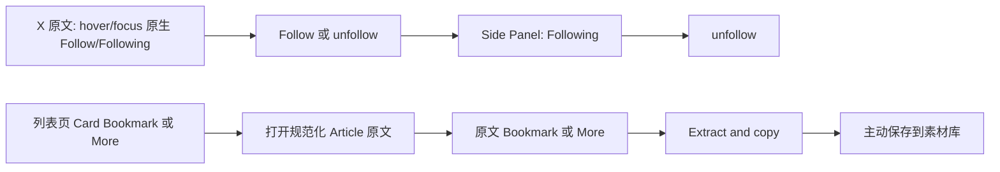

# x-to-md Content Inbox 产品方案

## 1. 文档信息

- 产品：x-to-md Chrome 扩展
- 版本方向：Content Inbox / X Article 工作台
- 状态：产品契约；后续实现以本文的原文提取边界为准
- 范围：订阅指定作者、手动获取指定时间范围内的 Article、候选集、素材库
- 不在本期：关键词热门搜索、后台定时监控、X API、自动发布、云端同步

## 2. 产品目标

用户当前的工作链路是：

> 浏览 X → 筛选内容 → Extract and copy → 粘贴到 x-to-xhs → 生成小红书笔记 → 人工审核发布

本期先缩短“找作者 Article、筛选、进入提取”的路径，同时保留用户对读取、提取和保存的明确控制。

产品结果不是自动替用户决定选题，而是提供一个可回溯的本地选题收件箱：

1. 用户维护关注的作者；
2. 用户手动选择时间范围并获取 Article；
3. 用户将有价值的 Article 加入候选集；
4. 点击候选标题打开 X 原文；
5. 用户在原文页点击 Extract and copy；
6. 用户主动保存为素材，供后续小红书创作复用。

## 3. 产品形态

主界面使用 Chrome Side Panel，不设计为独立 SaaS 后台，也不把核心流程塞进 Chrome Action Popup。

| 载体 | 职责 |
|---|---|
| X 原文页 | 现有 Extract and copy、预览、复制、保存素材 |
| Chrome Action Popup | 快捷入口：提取当前页、打开 Side Panel |
| Chrome Side Panel | 订阅源、候选集、素材库 |

Side Panel 以当前 X Bookmarks 中栏为候选卡的像素级视觉基准；用户无需离开 X，就能在右侧完成筛选和管理。候选阶段只保存用户加入时 Card 上实际可见的摘要与互动快照，不保存完整 Article 正文；标题点击后打开 X 原文，再由原页面完成真实 DOM 提取。

### 原文提取边界（优先级最高）

`Extract and copy` 只能在 Article 原文 URL（`/status/<id>`、`/<handle>/article/<id>` 或 `/i/article/<id>`）的 Bookmark 或 More 菜单中执行。作者主页 Posts、作者 Articles、Home、Bookmarks 等列表页的 Article Card Bookmark 和 More 只能提供“打开原文后提取”：导航至该 Card 已解析的规范化原文 URL，不读取列表页 DOM、不复制 Markdown、不创建素材。

该规则优先于本文任何可能被理解为列表页可直接提取的旧说明。

## 4. 核心导航

Side Panel 使用 X 式窄栏信息密度和底部 Tab 导航，提供四个一级入口：

- 候选集：当前待处理的 Article；
- 关注作者：X UserCell 作者列表与关注状态；
- 素材库：用户已经主动保存的 Markdown 素材；
- 统计：按时间范围查看历史新增候选趋势。

不使用左侧导航栏、数字步骤、仪表盘卡片或独立后台壳层；统计图表只在“统计”入口展示。

## 5. 页面设计

### 5.1 关注作者

目标：使用 X Follow UI 维护用户在原文中主动关注的作者。

页面结构：

1. 作者 UserCell 列表：40px 头像、显示名、认证标识、`@handle` 和简介；
2. 已关注作者只显示 X 式白底描边 `Following` 胶囊按钮；
3. 鼠标悬停或键盘聚焦时，按钮使用 X destructive token 并显示 `unfollow`；
4. 点击 `unfollow` 直接取消关注并从列表移除；
5. 点击作者头像、姓名、handle 或简介区域，在新标签页打开 `https://x.com/<handle>`；
6. 页面不提供手动添加、查看详情、编辑、启停、扫描或删除等其他作者操作。

### 5.2 候选集

目标：集中查看已发现但尚未处理的 Article。

页面结构：

1. 收件箱顶部直接显示筛选、总数和排序，不使用独立的标题/搜索图标顶栏；
2. 收件箱默认显示今日，支持昨日、本周、上周和本月；所有日期按候选 `addedAt` 的本地日历时间计算；
3. 搜索框按文章标题、作者名、handle 和 URL 过滤；
4. Article Cell 按 X Bookmarks Card 重建：`40px` 头像、作者行、Article 媒体卡和完整互动快照栏；
5. 作者行包含姓名、认证标识、handle、发布时间与 Grok 展示槽；右侧 `•••` 不显示、不实现，但保留相同几何槽位；
6. Article 卡包含约 `2.55:1` 封面、`15px/20px` 标题与加入时实际可见的摘要；旧候选缺字段时省略对应内容，不伪造占位数据；
7. 互动栏展示回复、转发、点赞、浏览、扩展书签、X 原生书签和分享快照；只有扩展书签具有按钮语义；
8. 点击标题卡片打开原始 X Article，并将候选标记为已查看；用户在原文页通过现有“保存并复制 Markdown”操作将完整 Markdown 保存到素材库；
9. 扩展书签默认显示蓝色已在收件箱状态，hover/focus 切换为红色 destructive 状态，名称统一为“从收件箱移除”；点击后写入内部 `ignored` 墓碑并立即从活动列表移除，素材库不受影响；
10. 原文 Bookmark 入口再次添加同一 URL 时复用历史记录、补齐最新可见快照并恢复为 `new`，不产生重复候选。

### 5.3 统计

目标：独立查看候选 Article 的历史新增趋势，不干扰收件箱处理状态。

页面结构：

1. 统计入口位于 Side Panel 一级导航，默认时间范围为本周；
2. 支持今日、昨日、本周、上周和本月；统计时间范围与收件箱筛选独立；
3. 显示“本范围新增”和“当前待处理”两个摘要指标；
4. 使用 X 风格折线图展示按 `addedAt` 统计的每日新增数量；
5. 新增趋势包含所有候选状态，包括 `ignored` 和 `saved`；当前待处理排除这两类状态；
6. 图表同时提供文字数据摘要，空范围显示明确的无数据说明。

候选状态：

- `新发现`
- `已查看`
- `已提取`
- `已从收件箱移除`（内部状态仍为 `ignored`）
- `已保存素材`

### 5.4 素材库

目标：管理已经主动保存的 Markdown 素材，而不是保存所有发现内容。

页面结构：

1. X 式顶栏：返回、`素材库`、搜索图标；
2. X 风格搜索输入；
3. Tab：`全部`、`未使用`、`已使用`；
4. 素材 Card 与收件箱共用 X Bookmarks Card 骨架：`40px` 头像列、单行作者/handle/`发布于 M/D · 收录于 M/D` 元数据、完整宽度约 `2.55:1` 媒体框、标题、使用状态与主操作；素材封面仅在媒体框内使用 `contain`，以保留文字信息；
5. 封面使用 `object-fit: contain`，保留全部视觉信息，点击后在 X 式遮罩中放大查看；历史素材或封面缺失时显示稳定 Article 占位；
6. Card 不显示 Markdown 摘要、展开或收起。完整 Markdown 仅由底部工具栏的 `预览 Markdown` 打开独立阅读页，返回后保留列表状态；
7. 当前数据模型没有创作实体，因此常驻底部显示 `未使用` / `已使用` 状态、`预览 Markdown`，以及未使用素材的黑色 X 式 `标记为已使用`按钮；不得伪造“已用于某篇创作”的关联。`打开原文`、复制 Markdown、标签、发布链接管理、标记未使用与删除收进 `•••`，删除仍需确认；
8. 标签编辑在 `•••` 的轻量浮层内完成，输入框不得撑开 Card；“管理发布链接”从 `•••` 打开 X 式居中弹层，用户可查看、打开、移除既有平台链接，或粘贴新链接；同一平台新链接替换旧链接，校验错误在输入框下方原位呈现。已发布平台以“已发布至”文字加品牌图标表达，不能仅以颜色或图标承担语义。

## 6. 关键交互流程



关键原则：候选集保存发现元数据；素材库保存用户主动提取并确认保存的正文。两者不能混为一个历史列表。

## 7. 数据模型

### 7.1 订阅源 `subscriptions`

```json
{
  "id": "sub_zostaff",
  "handle": "@zostaff",
  "displayName": "zostaff",
  "profileUrl": "https://x.com/zostaff",
  "authorAvatarUrl": "https://pbs.twimg.com/profile_images/example.jpg",
  "description": "Author bio from the visible X user cell"
}
```

### 7.2 候选 `candidates`

```json
{
  "id": "article_1842517662829531137",
  "sourceUrl": "https://x.com/zostaff/status/1842517662829531137",
  "authorHandle": "@zostaff",
  "title": "Harness Engineering: Designing the Scaffolding That Every Agent Needs",
  "authorName": "zostaff",
  "authorAvatarUrl": "https://pbs.twimg.com/profile_images/example.jpg",
  "authorVerified": true,
  "coverImageUrl": "https://pbs.twimg.com/media/example.jpg",
  "previewExcerpt": "加入收件箱时 X Card 上实际可见的摘要",
  "engagementSnapshot": {
    "reply": { "count": "38", "viewBox": "0 0 24 24", "paths": ["..."] },
    "repost": { "count": "15", "viewBox": "0 0 24 24", "paths": ["..."] },
    "like": { "count": "145", "viewBox": "0 0 24 24", "paths": ["..."] },
    "views": { "count": "51K", "viewBox": "0 0 24 24", "paths": ["..."] }
  },
  "previewCapturedAt": "2026-08-10T12:05:00Z",
  "publishedAt": "2026-08-08T10:00:00Z",
  "discoveredAt": "2026-08-10T12:00:00Z",
  "addedAt": "2026-08-10T12:05:00Z",
  "status": "new",
  "subscriptionId": "sub_zostaff"
}
```

候选以规范化 Article URL/ID 去重。`addedAt` 记录用户加入收件箱的时间；收件箱默认按它降序，也可按 `publishedAt` 降序。`previewExcerpt`、认证状态和互动快照只在用户主动加入时从当前 Card 局部 DOM 获取并写入 `chrome.storage.local`；不调用 X API，不后台打开页面。候选阶段不保存完整正文，不保存 Cookie、令牌或剪贴板内容。

### 7.3 素材 `assets`

```json
{
  "id": "asset_article_1842517662829531137",
  "candidateId": "article_1842517662829531137",
  "sourceUrl": "https://x.com/zostaff/status/1842517662829531137",
  "title": "Harness Engineering: Designing the Scaffolding That Every Agent Needs",
  "markdown": "# Harness Engineering...",
  "tags": ["AI", "内容生产"],
  "note": "待改写为小红书选题",
  "usageStatus": "unused",
  "createdAt": "2026-08-10T12:20:00Z",
  "updatedAt": "2026-08-10T12:20:00Z"
}
```

## 8. X UI 视觉铁律

候选 Card 的唯一视觉基准是用户提供的当前 X Bookmarks 中栏截图，并已记录于仓库级 [AGENTS.md](../../AGENTS.md)。600 CSS px、@2x 为严格复刻基准；窄 Side Panel 采用 X 式流式收缩，不缩放字体和图标。

已读取到的实际样式基准：

| Token | 实际值 |
|---|---|
| 主文字 | `rgb(15, 20, 25)` / `#0F1419` |
| X 链接蓝 | `rgb(29, 155, 240)` / `#1D9BF0` |
| 分隔线 | `rgb(239, 243, 244)` / `#EFF3F4` |
| 字体 | `TwitterChirp, -apple-system, "system-ui", "Segoe UI", Roboto, Helvetica, Arial, sans-serif` |
| 顶栏/Tab 高度 | `53px` |
| 返回按钮 | `36px`，`border-radius: 9999px` |
| Follow/主按钮 | `36px`，`border-radius: 9999px`，黑色背景 |
| 作者名 | `15px / 20px`，`font-weight: 700` |
| Article Cell 内边距 | 左右 `16px` |
| 候选头像 | `40px`，与内容列间距 `12px` |
| Article 封面 | 约 `2.55:1`，圆角 `12px` |
| 候选标题与摘要 | `15px / 20px` |
| 互动栏图标 | `18.75px`；只有扩展书签可交互 |
| 搜索输入 | `14px / 16px`，高度 `40px` |

实现要求：

- 不使用渐变蓝按钮；
- 不使用通用 SaaS 左侧导航；
- 不使用卡片阴影或卡片套卡片；
- 不用大标题制造层级，使用 X 的 Cell、Tab、Profile Header 和分隔线建立层级；
- 不用图像生成结果作为 UI 生产基准；
- 真实 X 页面改变后，重新读取 token 并进行人工视觉复核。

## 9. 权限、存储与隐私

本期不接入 X API，不新增云端采集服务，不做后台轮询。

建议权限：

- `activeTab`：用户主动在当前 X 页面提取；
- 现有 X host permissions：在支持的 X 页面运行内容脚本；
- `storage`：保存本地订阅源、候选元数据和用户主动保存的素材。

如未来增加手动批量获取，需要在 Manifest 中新增权限或扩大页面访问范围，必须单独说明、补充测试并重新确认。

## 10. 异常与空状态

- 未登录 X：`请先在 X 登录后再获取 Article`；
- 作者页面不是 Article 列表：`未找到可识别的 Article，请缩小时间范围或打开作者 Articles 页面`；
- 达到扫描上限：`本次只检查了前 N 条内容，建议缩小时间范围`；
- 无新 Article：`该时间范围内没有发现新的 Article`；
- 原文已删除：`原文已无法访问，候选元数据仍保留`；
- 提取失败：复用现有 Extract and copy 错误提示，不创建重复错误体系；
- 素材为空：`保存前请先完成 Extract and copy`。

## 11. 验收标准

### 功能

- 可以从 Profile Summary、Follow 列表 UserCell、Article 作者头部和 Profile 头部的原生 `Follow` 或 `Following` 按钮 hover/focus 管理扩展关注状态，不需要选取作者名称，且不影响 X 原生按钮点击；未在扩展列表时显示 `Follow`，已在列表时显示 `Following` 并在 hover/focus 变为红色 `unfollow`；增删后 Side Panel 实时同步头像、姓名、认证标识、handle 与可用简介；
- 已关注状态显示 `Following`，悬停/聚焦显示红色 `unfollow`，点击后取消关注；
- 关注作者页不存在手动添加、详情、编辑、启停、扫描或独立删除入口；
- 获取结果按 Article URL/ID 去重；
- 列表页 Article Card 的 Bookmark 与 More 提供“打开原文后提取”，并导航到该 Card 的规范化 `/status/<id>` 或 `/article/<id>`；它们不得直接执行 `Extract and copy`、读取列表页 DOM、复制 Markdown 或创建素材；
- 只有原文页 Article 的 Bookmark 与 More 显示 `Extract and copy`。原生 Bookmark hover/focus 时，于其左侧相邻位置显示书签操作，不得遮挡原生 Bookmark；未在收件箱时显示蓝色“添加至收件箱”，已在收件箱时显示实心书签状态并在 hover/focus 切换为红色“从收件箱移除”；移除后可再次添加，`ignored`/`saved` 历史候选会复用并恢复为 `new`，不产生重复 URL，且不会删除素材库；左侧空间不足时回退到右侧；
- 可以将 Article 加入收件箱、从收件箱移除并再次加入；两个移除入口均写入同一 `ignored` 墓碑状态并从活动统计中排除；
- 点击候选标题能打开对应 X 原文；
- 仅原文页的 Extract and copy 链路可读取 Article DOM，并保留标题、作者、封面、发表时间与摘要；
- 用户主动保存后素材进入素材库；
- 素材库支持按标题、作者、handle、标签和备注搜索，以及编辑标签/备注、复制 Markdown、打开原文和删除；封面不裁切，旧素材安全降级。

### 视觉与交互

- Side Panel 使用 X 式窄栏样式和底部 Tab 结构；统计入口独立展示筛选、摘要和添加趋势图；
- 候选文章列表在 600 CSS px、@2x 下复刻 X Bookmarks Card 的尺寸、字体、布局、图标、图片裁剪和 1px 分隔线；`•••` 不显示但保留槽位；
- 互动快照图标对辅助技术隐藏，只有扩展书签具有按钮语义，tooltip 与无障碍名称均为“从收件箱移除”；
- 主要按钮使用 X 的黑色胶囊样式；
- 链接使用 `#1D9BF0`，不使用渐变；
- 420px 左右宽度下不出现横向滚动；
- 键盘焦点、Esc 返回、加载、空状态和失败状态可见且可操作。

### 验证边界

静态检查和 Node 测试不能证明真实 X DOM、Side Panel 尺寸、剪贴板、响应式和浏览器交互已经通过。实现后必须在真实 Chrome、真实 X Article 页面和至少一个窄宽 Side Panel 中人工验收。

## 12. 实施顺序

1. 将 Side Panel 加入 Manifest，并建立共享 X UI token 与组件样式；
2. 实现 X Follow UserCell 与单一 Following/unfollow 操作；
3. 实现 Article 识别、时间筛选、去重和候选状态；
4. 将候选标题接入原文打开与现有 Extract and copy；
5. 实现素材库 CRUD、搜索和 Markdown 复制；
6. 补充异常/空状态、权限说明和测试；
7. 在真实 X 页面进行人工视觉与交互验收。
